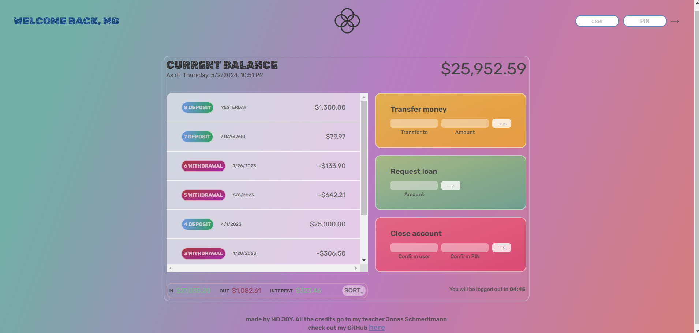

  

# Project Title

## This project is based on Jonas Schmedtmann's [Advanced JavaScript](https://www.udemy.com/user/jonasschmedtmann/) course. You should check his course. All the credits go to my beautiful teacher Jonas Schmedtmann--

## Bankist-App---JAVASCRIPT

✅[View demo](https://ph0enix46.github.io/Bankist-App---JAVASCRIPT/) 🐛[Bug report](https://github.com/pH0enix46/Bankist-App---JAVASCRIPT/issues)

## About
It's a Bankist-App based on JAVASCRIPT with a beautiful UI. It is a project of Jonas Schmedtmann's course. I am doing all the code manually and changing the UI myself. please check the code

### Screenshots


## Installation

Clone the repo
```
https://github.com/pH0enix46/Bankist-App---JAVASCRIPT.git
```

✅Enjoy! for learning 

❌But don't copy mine
## Acknowledgments
My lovely teacher [Jonas Schmedtmann](https://github.com/jonasschmedtmann)


```
Have a nice Day!😸
```

